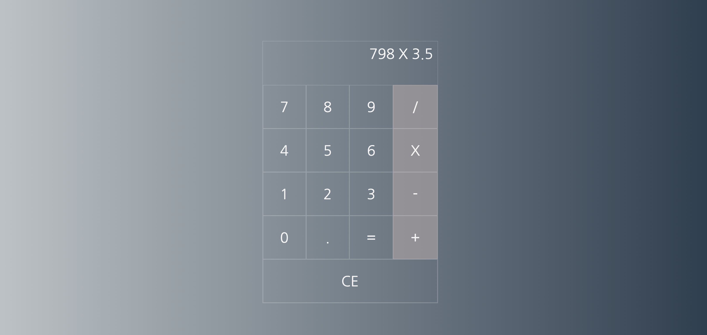

# Simple-Calculator
A simple calculator application built using Vanilla JS, HTML and CSS

## Steps to run:

#### `Install npm dependencies`

    npm install

#### `Run the app`

    npm start

#### `Run unit tests`

    npm test
